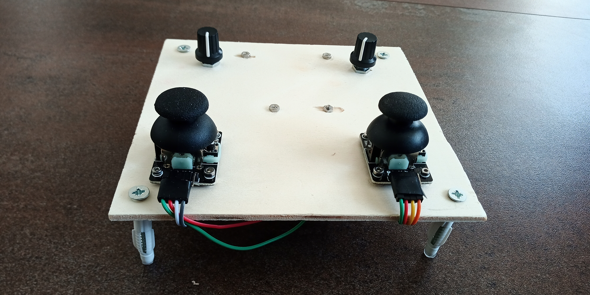
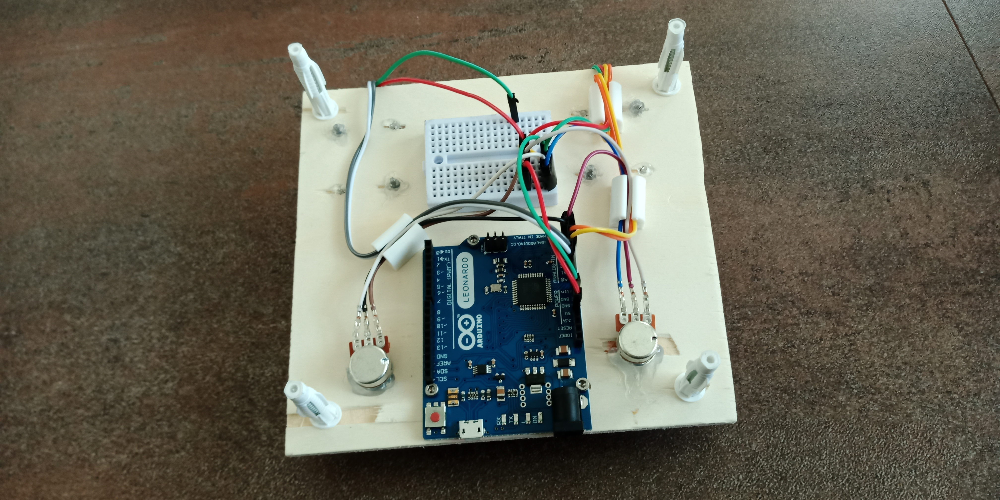

# MIDI Controller for VR camera

## Components
- Arduino Leonardo 
- 2x joystick 2-Axis
- 2x potenciometer

## How to use
Install the [MIDIUSB](https://github.com/arduino-libraries/MIDIUSB) library.

In Arduino IDE you can go Sketch > Include Library > Manage Libraries, find the USBMIDI and Install.

Upload the INO program into arduino. Your arduino will now be recognized as a MIDI device.

## Finished controller

